# System Architecture

## Overview
Enterprise ITSM platform designed for managed service delivery with multi-tenant isolation, API-first services, and ISO-aligned controls.

## Layered Architecture

```mermaid
flowchart TB
  subgraph L1[Layer 1 - Access]
    Web[Web Portal - Self Service]
    Agent[Agent Portal]
    Mobile[Mobile Responsive UI]
    APIGW[API Gateway]
  end

  subgraph L2[Layer 2 - Application]
    IAM[Identity and Access]
    Incident[Incident Service]
    Request[Service Request Service]
    Problem[Problem Service]
    Change[Change Enablement]
    CMDB[CMDB Service]
    Asset[Asset Service]
    SLA[SLA and OLA Engine]
    Knowledge[Knowledge Base]
    Workflow[Workflow Engine]
    Analytics[Reporting and Analytics]
    Audit[Audit and Compliance]
  end

  subgraph L3[Layer 3 - Data]
    PG[(PostgreSQL HA Cluster)]
    Redis[(Redis Cache and Queue)]
    Obj[(Object Storage - Attachments)]
    Logs[(Log Storage - SIEM Ready)]
  end

  subgraph L4[Layer 4 - Integration]
    M365[Microsoft 365]
    AD[Azure AD / LDAP]
    Monitor[Zabbix / PRTG]
    SIEM[Wazuh / SIEM]
    ERP[ERPNext]
    Discover[Network Discovery]
    Email[Email Gateway]
    WA[WhatsApp Business API]
  end

  Web --> APIGW
  Agent --> APIGW
  Mobile --> APIGW

  APIGW --> IAM
  APIGW --> Incident
  APIGW --> Request
  APIGW --> Problem
  APIGW --> Change
  APIGW --> CMDB
  APIGW --> Asset
  APIGW --> SLA
  APIGW --> Knowledge
  APIGW --> Workflow
  APIGW --> Analytics
  APIGW --> Audit

  Incident --> PG
  Request --> PG
  Problem --> PG
  Change --> PG
  CMDB --> PG
  Asset --> PG
  SLA --> PG
  Knowledge --> PG
  Workflow --> PG
  Audit --> PG

  Incident --> Redis
  Workflow --> Redis
  Analytics --> Logs
  Audit --> Logs
  Knowledge --> Obj

  IAM --> AD
  Incident --> Email
  Analytics --> SIEM
  APIGW --> M365
  APIGW --> Monitor
  APIGW --> ERP
  APIGW --> Discover
  APIGW --> WA
```

## Security Architecture
- Zero Trust design with strict identity verification and least privilege.
- Reverse proxy hardened (Nginx) with WAF support (Cloudflare or ModSecurity).
- MFA enforcement for privileged actions and admin portals.
- Immutable audit logging with hash chaining and SIEM export.
- Encryption in transit (TLS 1.2+) and at rest (DB + object storage).

## Multi-Tenant Isolation
- Default: schema-per-tenant with shared app services.
- Enterprise option: dedicated database for regulated clients.
- Tenant-specific SLA, branding, and configuration.
- Super Admin scope for internal ops only.

## Non-Functional Requirements
- Response time < 2 seconds for normal load.
- Concurrency >= 500 users.
- Availability >= 99.5%.
- RPO <= 15 minutes, RTO <= 4 hours.
- Audit log retention >= 1 year.
