# ERD Database Schema

```mermaid
erDiagram
  TENANT ||--o{ TENANT_BRANDING : has
  TENANT ||--o{ USER : owns
  TENANT ||--o{ TEAM : owns
  TENANT ||--o{ SLA_POLICY : defines
  TENANT ||--o{ SERVICE : publishes

  USER ||--o{ USER_ROLE : assigned
  ROLE ||--o{ USER_ROLE : contains
  ROLE ||--o{ ROLE_PERMISSION : grants
  PERMISSION ||--o{ ROLE_PERMISSION : includes

  INCIDENT ||--o{ INCIDENT_ACTIVITY : has
  INCIDENT ||--o{ INCIDENT_ATTACHMENT : has
  INCIDENT ||--o{ INCIDENT_LINK : relates
  INCIDENT ||--o{ PROBLEM : links
  INCIDENT ||--o{ CI : impacts

  SERVICE_REQUEST ||--o{ REQUEST_APPROVAL : requires
  SERVICE_REQUEST ||--o{ REQUEST_ACTIVITY : has

  PROBLEM ||--o{ ROOT_CAUSE : includes
  PROBLEM ||--o{ KNOWN_ERROR : results

  CHANGE ||--o{ CHANGE_APPROVAL : has
  CHANGE ||--o{ CHANGE_TASK : includes
  CHANGE ||--o{ CHANGE_CALENDAR : scheduled
  CHANGE ||--o{ RISK_ASSESSMENT : evaluates

  CI ||--o{ CI_RELATIONSHIP : relates
  CI ||--o{ ASSET : maps

  ASSET ||--o{ ASSET_LIFECYCLE : tracks
  ASSET ||--o{ CONTRACT : covered

  SLA_POLICY ||--o{ SLA_TARGET : defines
  SLA_TARGET ||--o{ SLA_TIMER : measures
  SLA_TIMER ||--o{ ESCALATION_RULE : triggers

  KNOWLEDGE_ARTICLE ||--o{ ARTICLE_VERSION : versioned
  KNOWLEDGE_ARTICLE ||--o{ ARTICLE_TAG : tagged

  WORKFLOW ||--o{ WORKFLOW_STEP : contains
  WORKFLOW ||--o{ WORKFLOW_INSTANCE : executes
  WORKFLOW_INSTANCE ||--o{ WORKFLOW_TRANSITION : records

  AUDIT_LOG {
    uuid id
    uuid tenant_id
    uuid actor_id
    string action
    string entity_type
    uuid entity_id
    string hash
    string prev_hash
    datetime created_at
  }

  USER ||--o{ AUDIT_LOG : produces
  TENANT ||--o{ AUDIT_LOG : stores
```

## Notes
- UUID for all primary keys.
- Each table includes `tenant_id` for schema-per-tenant or logical isolation.
- Audit log is immutable with hash chaining.
- Attachments stored in object storage with metadata in DB.
