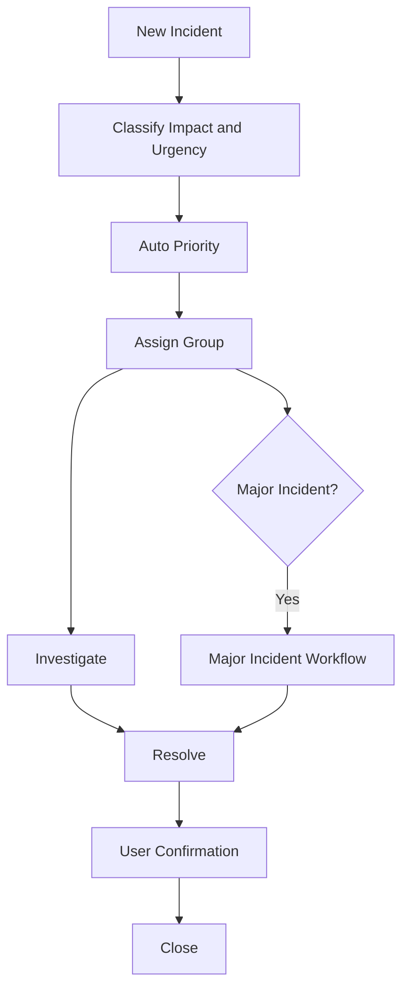
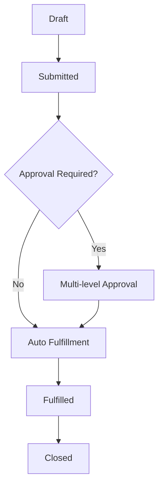
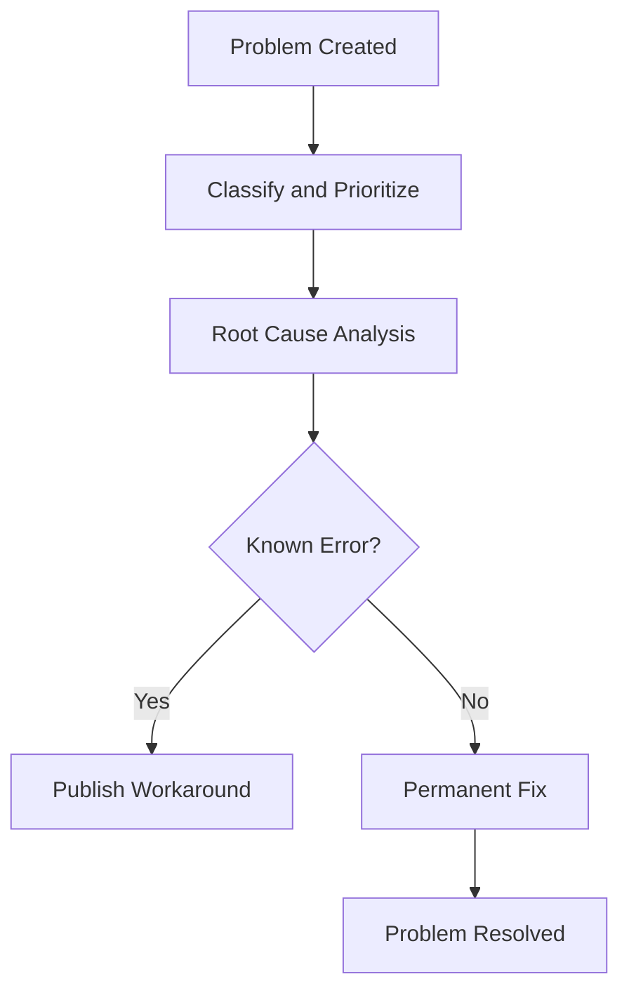
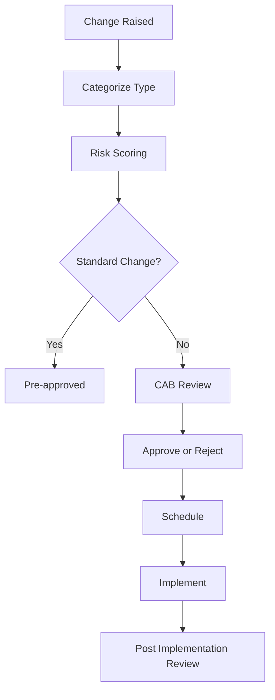
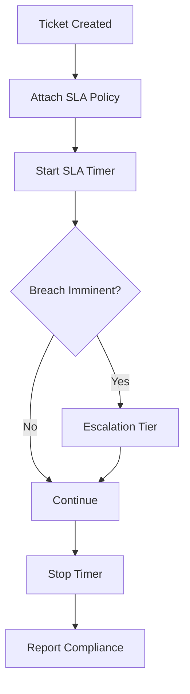
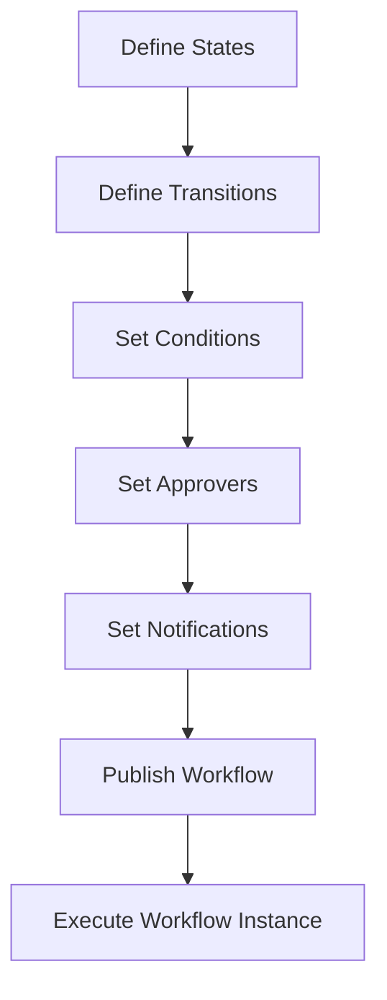

# Workflow Diagrams

## Incident Management

```mermaid
flowchart TD
  A[New Incident] --> B[Classify Impact and Urgency]
  B --> C[Auto Priority]
  C --> D[Assign Group]
  D --> E[Investigate]
  E --> F[Resolve]
  F --> G[User Confirmation]
  G --> H[Close]
  D --> I{Major Incident?}
  I -->|Yes| J[Major Incident Workflow]
  J --> F
```

## Service Request Management

```mermaid
flowchart TD
  A[Draft] --> B[Submitted]
  B --> C{Approval Required?}
  C -->|Yes| D[Multi-level Approval]
  C -->|No| E[Auto Fulfillment]
  D --> E
  E --> F[Fulfilled]
  F --> G[Closed]
```

## Problem Management

```mermaid
flowchart TD
  A[Problem Created] --> B[Classify and Prioritize]
  B --> C[Root Cause Analysis]
  C --> D{Known Error?}
  D -->|Yes| E[Publish Workaround]
  D -->|No| F[Permanent Fix]
  F --> G[Problem Resolved]
```

## Change Enablement

```mermaid
flowchart TD
  A[Change Raised] --> B[Categorize Type]
  B --> C[Risk Scoring]
  C --> D{Standard Change?}
  D -->|Yes| E[Pre-approved]
  D -->|No| F[CAB Review]
  F --> G[Approve or Reject]
  G --> H[Schedule]
  H --> I[Implement]
  I --> J[Post Implementation Review]
```

## SLA and OLA Engine

```mermaid
flowchart TD
  A[Ticket Created] --> B[Attach SLA Policy]
  B --> C[Start SLA Timer]
  C --> D{Breach Imminent?}
  D -->|Yes| E[Escalation Tier]
  D -->|No| F[Continue]
  E --> F
  F --> G[Stop Timer]
  G --> H[Report Compliance]
```

## Workflow Engine (No-code)

```mermaid
flowchart TD
  A[Define States] --> B[Define Transitions]
  B --> C[Set Conditions]
  C --> D[Set Approvers]
  D --> E[Set Notifications]
  E --> F[Publish Workflow]
  F --> G[Execute Workflow Instance]
```
