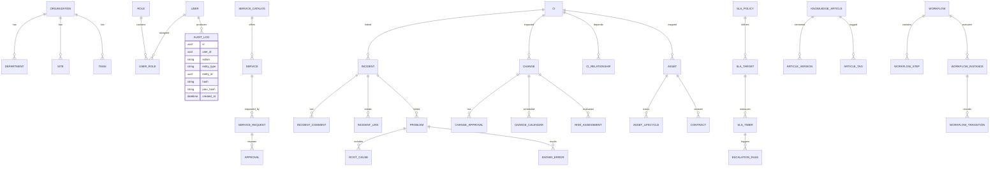

# 02. ERD (Entity Relationship Design)

## Notes
- Use UUIDs for all primary keys.
- Immutability: `AUDIT_LOG` stores hash chains (prev_hash, hash).
- Multi-tenancy: all domain entities carry `organization_id`.
