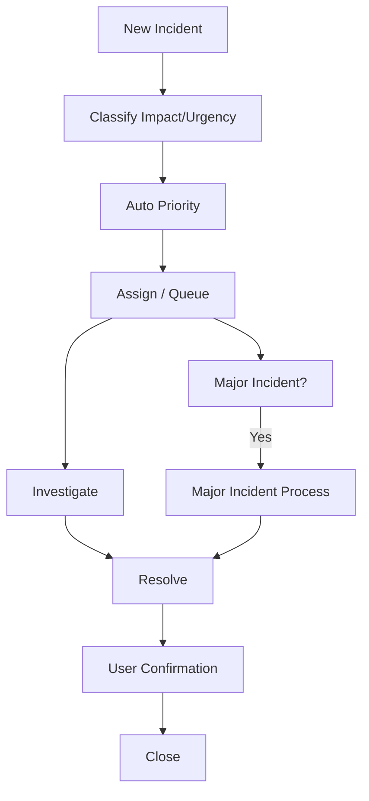
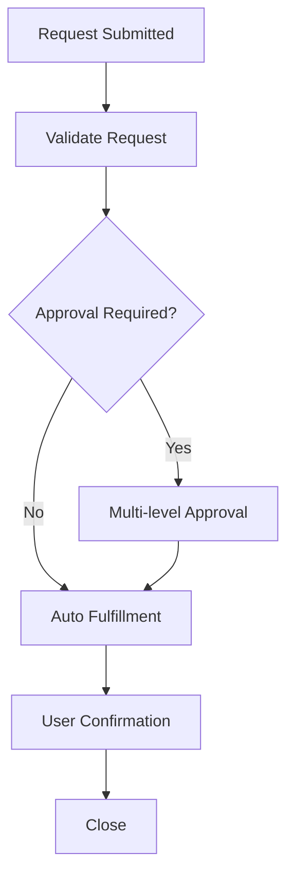
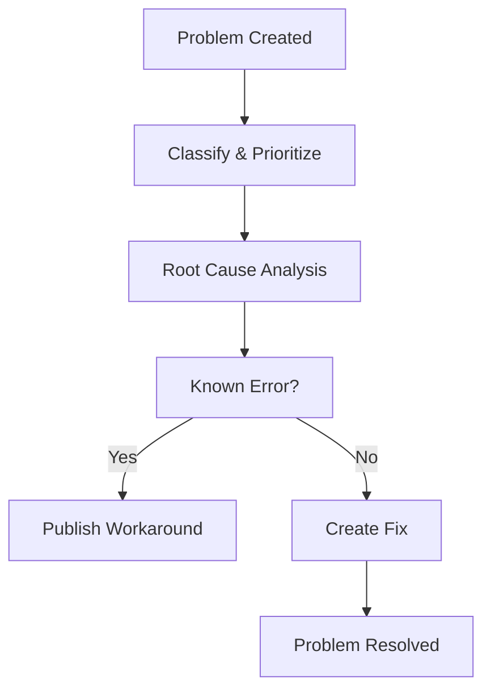
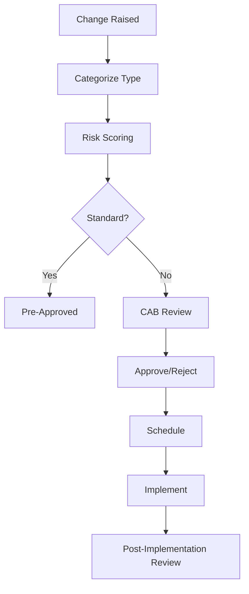
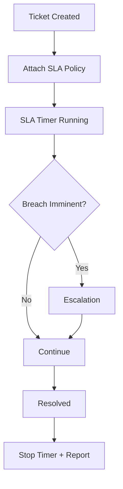
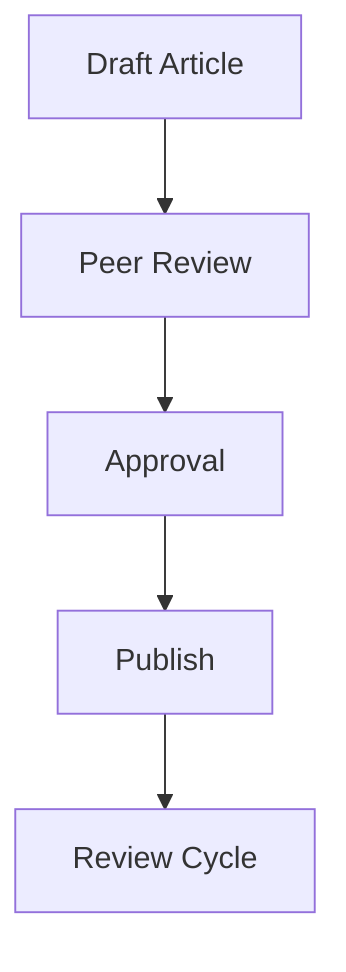
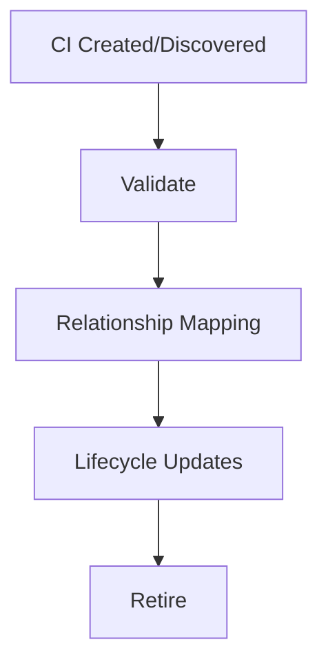

# 03. Workflow Diagrams (ITIL v4 Practices)

## Incident Management

## Service Request Management

## Problem Management

## Change Enablement

## Service Level Management

## Knowledge Management

## CMDB & Asset Management

